# Desafio AWS

Este repositório será utilizado para armazenar os arquivos e documentações referentes ao desafio AWS.


## Objetivo do Projeto


Foi disponibilizada a descrição do desafio, presente no arquivo `desafio-aws/DESCRIÇÃO_DESAFIO.md`, onde o objetivo é construir uma stack de infraestrutura que provisione um ambiente capaz de rodar os componentes descritos no cenário relatado. Dessa forma, este projeto visa atender essa demanda explorando soluções e debater, tanto as tecnologias (usadas ou não), quanto os custos associados.


## Premissas do Projeto

- Testar as soluções propostas, mantendo o custo baixo
- Foco em segurança e boas práticas


## Visão Geral da Solução Proposta


Analisando a descrição do desafio, pensei inicialmente em utilizar a seguinte estrutura:

- Cloudfont para CDN
- S3 para o site estático
- Função Lambda para a API
- RDS para o banco de dados
- Cloudwatch para monitoramento e alertas

Com essa stack é possível atender a descrição, sendo escalável e mantendo o custo baixo. Porém, por se tratar de um Desafio sobre AWS, optei por fazer de forma a explorar as possíbilibilidades que a cloud da AWS pode proporcionar.

Assim, optei por fazer utilizando a seguinte estrutura:

- Cloudfont para CDN
- ALB na rede pública, para centralizar e direcionar o tráfego para a rede privada
- Containers para as aplicações
- EKS para a orquestração dos containers
- Signoz (Solução de APM opensource) para monitoramento e alertas.


## Estrutura do Projeto


Para a execução do projeto, foi criado um único repositório para hospedar todo o código. A seguir está a estrutura de arquivos e diretórios utilizado no projeto:

```bash
wander@bsnote283:~/desafio-aws$ tree
.
├── DESCRIÇÃO_DESAFIO.md
├── img
│   └── repository.drawio.png
├── infra
│   ├── alb.tf
│   ├── cdn.tf
│   ├── destroy_config.json
│   ├── ec2.tf
│   ├── eks.tf
│   ├── envs
│   │   ├── dev
│   │   │   ├── K8s-Infra-value.yaml
│   │   │   └── terraform.tfvars
│   │   └── prd
│   │       ├── K8s-Infra-value.yaml
│   │       └── terraform.tfvars
│   ├── main.tf
│   ├── outputs.tf
│   ├── provider.tf
│   ├── rds.tf
│   ├── route53.tf
│   ├── security-groups.tf
│   ├── signoz-helm.tf
│   ├── variables.tf
│   └── vpc.tf
├── README.md
└── src
    ├── docker-compose.yml
    ├── go-calculator
    │   ├── Dockerfile
    │   ├── go.mod
    │   ├── go.sum
    │   ├── k8s
    │   │   └── manifesto.yaml
    │   ├── main.go
    │   └── testes
    │       └── calculator.http
    ├── magic-calculator
    │   ├── app.py
    │   ├── Dockerfile
    │   ├── k8s
    │   │   └── manifesto.yaml
    │   ├── requirements.txt
    │   └── templates
    │       ├── error.html
    │       ├── index.html
    │       └── result.html
    └── README.md

12 directories, 38 files
wander@bsnote283:~/desafio-aws$ 


```

O projeto pode ser dividido basicamente em três partes:

- **Aplicações:** A pasta `src` contém o código das aplicações propriamente ditas.

- **Workflows:** A pasta `.github/workflows` contém os códigos de definições dos workflows criadas.

- **Infraestrutura:** A pasta `infra` contem o código relacionado a criação da infraestrutura.


> **OBSERVAÇÃO:**
>
> - Os arquivos de Aplicação e Infraestrutura estão no mesmo repositório do GitHub por conveniência. Em ambientes reais, principalmente se a infraestrutura for compartilhada, é recomendado que estejam em repositórios separados.
>

Nos itens a seguir estão datalhados cada uma das três partes principais.


## Aplicações


Foram desenvolvidas duas aplicações: API que se chama `api-calculadora` e um frontend que se chama `magic-calculator`. Para a realização de testes locais foi criado um arquivo docker-compose no caminho `desafio-aws/src/docker-compose.yml`. Para subir os testes locais basta executar o seguinte comando:

```bash

docker-compose up -d

```
Com isso, será incializado um containter do banco de dados MySQL e serão gerados os containers tanto da API quanto do Frontend com base nos Dockerfiles `src/go-calculator/Dockerfile` e `src/magic-calculator/Dockerfile`, respectivamente.


### api-calculadora


A API responde no path `/backend` a dois verbos HTTP: GET e POST. Para o GET ela responde apenas uma mensagem de health check e código 200 enquanto para o POST ela recebe um nome e dois números inteiros, devolvendo o resultado da soma. Além disso, o handler do POST salva o nome do usuário, os dois números e a hora da chamada no banco de dados MySQL.

> **OBSERVAÇÃO:**
>
> - Ao inicializar, a API verifica o banco de dados e tabela para gravação dos dados. Caso ela não exista, ela é criada.
>

Para realizar os testes locais, pode ser utilizado o comando `curl` da seguinte forma:

```bash

wander@bsnote283:~/desafio-aws/src$ curl http://localhost:7000/backend -i
HTTP/1.1 200 OK
Date: Wed, 02 Apr 2025 12:11:51 GMT
Content-Length: 18
Content-Type: text/plain; charset=utf-8

API em execução!
wander@bsnote283:~/desafio-aws/src$ 
wander@bsnote283:~/desafio-aws/src$ curl -X POST http://localhost:7000/backend -H "Content-Type: application/json" -d '{"nome":"Wander", "operador1":5, "operador2":10}' -i
HTTP/1.1 200 OK
Date: Wed, 02 Apr 2025 12:12:03 GMT
Content-Length: 17
Content-Type: text/plain; charset=utf-8

{"resultado":15}
wander@bsnote283:~/desafio-aws/src$ 

```

> **OBSERVAÇÃO:**
>
> - Caso esteja utilizando o VScode, há uma extensão chamada `REST Client` que realizada chamadas baseadas em arquivo `.http`. Foi criado o arquivo `src/go-calculator/testes/calculator.http` contendo algumas chamadas, tanto de sucesso quanto de erro, para realizar os testes da API.
>


Para validar a inserção no banco de dados, podemos acessar o shell do container e verificar o conteúdo da tabela, conforme os comandos abaixo:


```bash

wander@bsnote283:~/desafio-aws/src$ docker ps
CONTAINER ID   IMAGE          COMMAND                  CREATED         STATUS                   PORTS                                                    NAMES
e19524876872   src-frontend   "python app.py"          3 minutes ago   Up 3 minutes             0.0.0.0:5000->5000/tcp, [::]:5000->5000/tcp              front-magic-calculator
265f9f731a4e   src-api        "./api"                  3 minutes ago   Up 3 minutes             0.0.0.0:7000->7000/tcp, [::]:7000->7000/tcp              go-calculator
3d38c5ee3f43   mysql:8.0      "docker-entrypoint.s…"   3 minutes ago   Up 3 minutes (healthy)   0.0.0.0:3306->3306/tcp, [::]:3306->3306/tcp, 33060/tcp   mysql-8
wander@bsnote283:~/desafio-aws/src$
wander@bsnote283:~/desafio-aws/src$ docker exec -it mysql-8 /bin/bash
bash-5.1# mysql -h localhost -P 3306 -uuser -ppassword -D go-calculator
mysql: [Warning] Using a password on the command line interface can be insecure.
Reading table information for completion of table and column names
You can turn off this feature to get a quicker startup with -A

Welcome to the MySQL monitor.  Commands end with ; or \g.
Your MySQL connection id is 30
Server version: 8.0.41 MySQL Community Server - GPL

Copyright (c) 2000, 2025, Oracle and/or its affiliates.

Oracle is a registered trademark of Oracle Corporation and/or its
affiliates. Other names may be trademarks of their respective
owners.

Type 'help;' or '\h' for help. Type '\c' to clear the current input statement.

mysql> show databases;
+--------------------+
| Database           |
+--------------------+
| go-calculator      |
| information_schema |
| performance_schema |
+--------------------+
3 rows in set (0.00 sec)

mysql> show tables;
+-------------------------+
| Tables_in_go-calculator |
+-------------------------+
| operacoes               |
+-------------------------+
1 row in set (0.00 sec)

mysql> select * from operacoes;
+----+--------+-----------+-----------+---------------------+
| id | nome   | operador1 | operador2 | data_execucao       |
+----+--------+-----------+-----------+---------------------+
|  1 | Wander |         5 |        10 | 2025-04-02 12:30:50 |
|  2 | Wander |         5 |       -10 | 2025-04-02 12:30:57 |
|  3 | Wander |        -5 |       -10 | 2025-04-02 12:31:05 |
+----+--------+-----------+-----------+---------------------+
3 rows in set (0.00 sec)

mysql> exit
Bye
bash-5.1# exit
exit
wander@bsnote283:~/desafio-aws/src$ 

```


### magic-calculator


O magic-calculator é um frontend para utilização da API api-calculadora e responde no path `/frontend`. A seguir estão os prints das telas da aplicação:

Tela principal
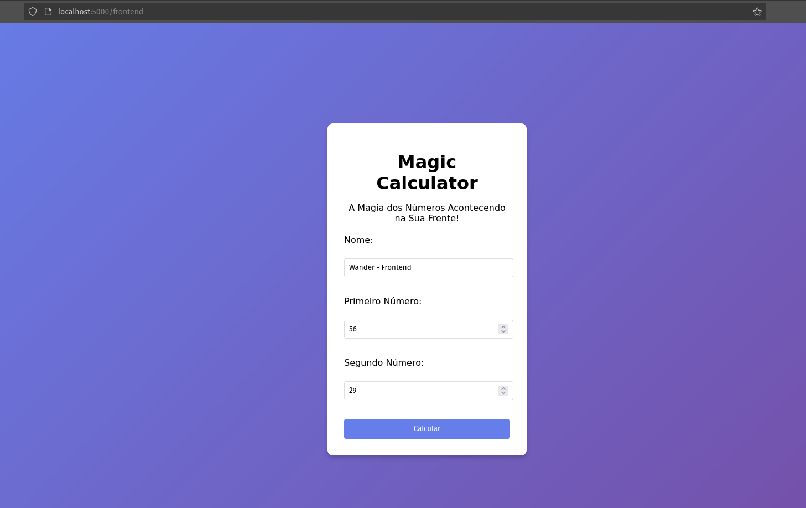


Tela de resultado
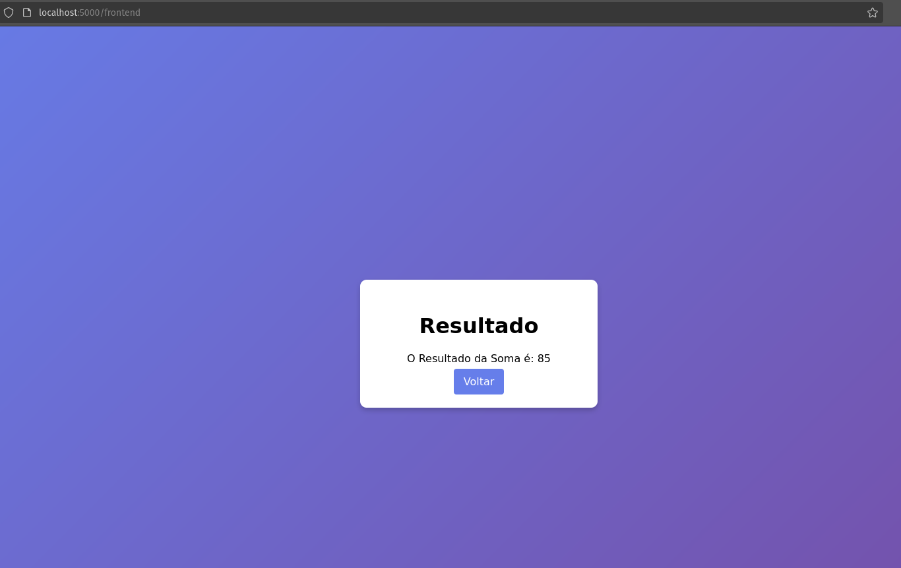


## Workflows (GitHub Actions)


Conforme mensionado anteriormente, foi criado um único repositório que será utilizado para armazenar todo o código. Neste repositório foram criadas duas branchs principais: a de develop, para o ambiente de desenvolvimento, e a branch main, para o ambiente de produção. 

Essas duas branchs serão utilizadas tanto para a Infraestrutura quanto para a homologação.

O fluxo de execução está representando no diagrama a seguir:

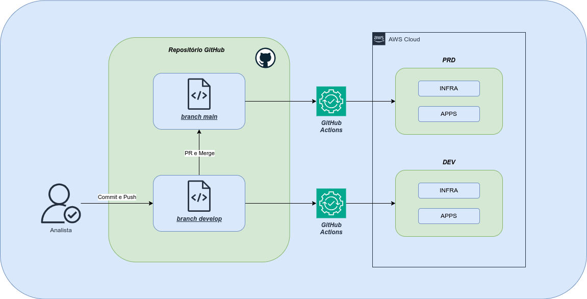


O Analista (dev ou infra) vai realizar o commit e um push para a branch de develop. Ao fazer isso, é acionada a trigger do GitHub Actions e a pipeline de homologação é executada, realizando o deploy de homologação da infra e/ou da aplicação.

Quando é realizado o Pull Request (PR) da branch de develop para a main, é acionado o trigger da pipeline de produção, realizando o deploy de produção da infra e/ou da aplicação.

> **OBSERVAÇÃO:**
>
> - O fluxo descrito acima é uma implementação de uma simples estratégia de branch. No ambiente produtivo podem ser implementadas outras estratégias, como por exemplo uma Feature Branch.
>

### Detalhamento dos Workflows

Neste projeto criamos oito workflows, cinco para as duas aplicações (frontend e api) e três para a infraestrutura. A seguir estão os arquivos de cada workflow na pasta `.github/workflows/`:


```bash
wander@bsnote283:~/desafio-aws$ tree .github/workflows/
.github/workflows/
├── api-dev-calculadora-api.yml
├── api-prd-calculadora-api.yml
├── ci-cd.yml
├── front-dev-magic-calculator.yml
├── front-prd-magic-calculator.yml
├── infra-dev.yml
├── infra-prd.yml
└── terraform.yml

0 directories, 8 files
wander@bsnote283:~/desafio-aws$ 

```

Para reaproveitar o código dos workflows, foi escolhida uma estratégia na qual temos dois workflows principais: `ci-cd.yml` (para aplicação) e `terraform.yml` (para infraestrutura).

O Workflow declarado no arquivo `ci-cd.yml` é responsável por executar o "trabalhao pesado" para os quatro workflows de aplicação (dev e prd da api, dev e prd do frontend), enquanto o arquivo `terraform.yml` segue a mesma ideia, executando o "trabalho pesado" para os dois workflows de infraestrutura (dev e prd).

### Triggers dos workflows

Como estamos utilizando apenas um repositório para a infraestrutura e para as duas aplicações (api e frontend), é necessário realizar uma definição nos workflows para que cada um seja disparado apenas quando fizer parte do contexto da alteração que estiver sendo realizada. A seguir está um detalhamento de como essa lógica está funcionando:


- **Workflow api-dev-calculadora-api** - Modificação da branch **develop** e alteração nos arquivos `"src/go-calculator/**"`. Passa os parâmetros e executa o worflow do arquivo `ci-cd.yml` para realizar o deploy de DEV.

- **Workflow api-prd-calculadora-api** - Modificação da branch **main** e alteração nos arquivos `"src/go-calculator/**"`. Passa os parâmetros e executa o worflow do arquivo `ci-cd.yml` para realizar o deploy de PRD.

- **Workflow front-dev-magic-calculator** - Modificação da branch **develop** e alteração nos arquivos `"src/magic-calculator/**"`. Passa os parâmetros e executa o worflow do arquivo `ci-cd.yml` para realizar o deploy de DEV.

- **Workflow front-prd-magic-calculator** - Modificação da branch **main** e alteração nos arquivos `"src/magic-calculator/**"`. Passa os parâmetros e executa o worflow do arquivo `ci-cd.yml` para realizar o deploy de PRD.

- **Workflow infra-dev** - Modificação da branch **develop** e alteração nos arquivos `"infra/**"`. Passa os parâmetros e executa o worflow do arquivo `terraform.yml` para realizar o deploy da infraestrutura pra DEV.

- **Workflow infra-prd** - Modificação da branch **main** e alteração nos arquivos `"infra/**"`. Passa os parâmetros e executa o worflow do arquivo `terraform.yml` para realizar o deploy da infraestrutura pra PRD.


A seguir está o código do worflow ``api-dev-calculadora-api.yml` (todos os demais seguem a mesma lógica) para facilitar o entendimento:


```yaml

name: "API - CALCULADORA DEV DEPLOY"

on:
  push:
    branches: ["develop"]
    paths: ["src/go-calculator/**"]
  workflow_dispatch:
    

# Permission can be added at job level or workflow level    
permissions:
      id-token: write   # This is required for requesting the JWT
      contents: read    # This is required for actions/checkout

jobs:
  CI-CD:
    uses: ./.github/workflows/ci-cd.yml
    secrets:
      dockerhub-username: ${{ secrets.DOCKERHUB_USERNAME }}
      dockerhub-token: ${{ secrets.DOCKERHUB_TOKEN }}
      aws-access-key-id: ${{ secrets.AWS_ACCESS_KEY_ID }}
      aws-secret-access-key: ${{ secrets.AWS_SECRET_ACCESS_KEY }}
      db-user: ${{ secrets.DB_USER }}
      db-password: ${{ secrets.DB_PASSWORD }}
    with:
      aws-region: "us-east-1"
      environment: "dev"
      app-name: "calculadora-api"
      app-path: "src/go-calculator"
      app-namespace-kubernetes: "calculator"

```


### Workflow "APPS - CI/CD" (ci-cd.yml)


Esse workflow é responsável pelo processo de CI/CD das aplicações. Ele é composto por dois jobs: job "CI", que é responsável por gerar a imagem do container e publicar no DockerHub e o jov "CD" que é responsável por ajustar o manifesto kubernestes e realizar o deploy da aplicação.


O `Job CI` gera uma imagem de container a partir do Dockerfile, aplica as tags da `latest` e a versão gerada. 

A versão é definida utilizando duas variáveis: `environment`, que é recebida por parâmetro e define qual ambiente está sendo executado, e `run_number`, que é uma variável do próprio GihubActions gerada automaticamente contendo o id da execução do workflow. 

Abaixo segue o print do DockerHub demonstrando os repositórios criados:

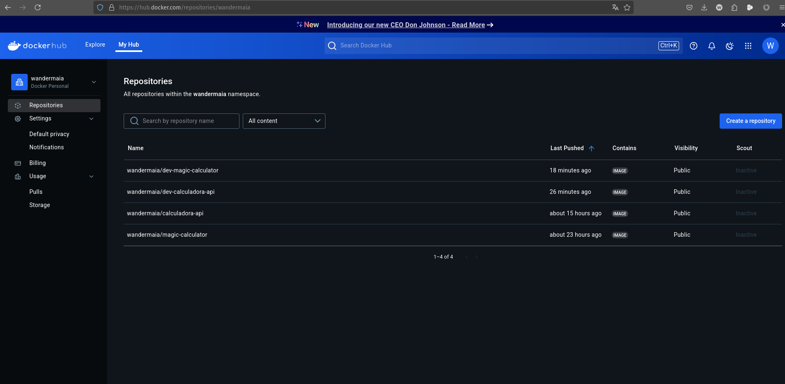


O `Job CD` atualiza o manifesto kubernetes com os valores necessários e aplica no cluster EKS. Depois disso, foi criado um step que utiliza o `AWS CLI` para executar as seguintes ações:

- Coleta o DNS do NLB associado com o service kuberetes da aplicação

- Identifica os IPs associados com o NLB

- Identifica o nome do target group do ALB de aplicações e associa os IPs do NLB no target group

Esse step está abordado no item de `Infraestrutura` deste documento, onde está contextualizado.


### Workflow "INFRA - CI/CD" (terraform.yml)


Esse workflow é responsável pelo processo de criação ou destruição da infraestrutura. Para a implementação desse workflow foi criado o arquivo `infra/destroy_config.json` que contém uma flag para cada ambiente (DEV e PRD) que sinaliza se é para destruir o ambiente ou não. Essa flag é considerada nos steps do workflow para definir se está criando/atualizando ou destruindo a infraestrutura. A seguir está um exemplo do formato desse arquivo:

```json
{
    "dev": true,
    "prd": true
}

```
As configurações desse arquivo são definidas com base nos workspaces do terraform para definir se o ambiente executado é homologação ou produção.


### Integração GitHub Actions com AWS

A integraçao inicialmente foi realizada usando openidentity, mas tive problemas com permissões no cluster do EKS e precisei voltar a usar acess_key e secret_key para não perder muito tempo.

Essa forma de conexão, utilizando o openidentity, é mais segura e restrita e deve ser preferencialmente utilizada. 


Uma melhoria interessante que pode ser adicionada nesse workflow é a inclusão da ferramenta **[Infracost](https://github.com/infracost/infracost)**. Essa ferramenta realiza uma estimativa de custos com base na execução do terraform plan e pode ser utilizada juntamente com um passo de aprovação antes da criação.


## Infraestrutura


Para a criação da Infraestrutura foi utilizada apenas uma conta da AWS, onde o ambiente de DEV e PRD utilzam VPCs diferentes. Esta abordagem foi utilizada para facilitar o projeto. Em ambiente produtivo é recomendado usar segregação por contas AWS. Caso não seja possível utilizar mais de uma conta, pelo menos criar os ambientes em regiões diferentes da AWS já é uma melhor escolha.

A seguir estão os tópicos relacionados a criação da infraestrutura.


### Terraform


A ferramenta utilizada para criar a infraestrutura foi o terraform. 

Para a configuração de backend foi utilizado um bucket S3 para armazenar o arquivos de State e o Lock. O bucket utilizado para este projeto se chama `wandermaia-terraform-statefile` e é altamente recomendado que esse o bucket esta com a opção **Bucket Versioning Habilitada**.

> **OBSERVAÇÃO:**
> 
> - A função **DynamoDB-based locking** está obsoleta e será removida em uma versão futura do Terraform.
>

Foram confiugrados três providers para utilização no terraform:

- **aws:** para interagir com os recursos da AWS

- **kubernetes:** para gerenciar os recursos do kubernetes

- **helm:** para gerenciar os charts no cluster kubernetes


Todos os arquivos do terraform estão na pasta `desafio-aws/infra`.

Dentro dessa pasta foi criado um diretório que contém os arquivos de variáveis `terraform.tfvars` de cada workspace, também segregados por pastas. Para este projeto serão utilizados dois workspaces: dev e prd.

A seguir está a estrutura de diretórios e arquivos da pasta de infra:

```bash

wander@bsnote283:~/desafio-aws$ tree infra
infra
├── alb.tf
├── cdn.tf
├── destroy_config.json
├── ec2.tf
├── eks.tf
├── envs
│   ├── dev
│   │   ├── K8s-Infra-value.yaml
│   │   └── terraform.tfvars
│   └── prd
│       ├── K8s-Infra-value.yaml
│       └── terraform.tfvars
├── main.tf
├── outputs.tf
├── provider.tf
├── rds.tf
├── route53.tf
├── security-groups.tf
├── signoz-helm.tf
├── variables.tf
└── vpc.tf

3 directories, 18 files
wander@bsnote283:~/desafio-aws$

```

Para outputs, foram configurados apenas três itens: o Endpoint do cluster EKS, o nome do cluster EKS e o comando necessário para configurar o kubeconfig utilizando o AWS CLI.

Nós próximos itens serão datalhados as criações dos recursos.


### VPC


A estrutura da VPC está definida para utilizar três Zonas de disponibilidade. Para este projeto foi definido que serão utilizadas três tipos de subnetes: Database, Privada e Pública.

As subnets de databases (uma para cada zona de disponibilidade) são exclusivas para a utilização de RDS ou servidores de bancos de dados. Foi definido um subnet group contendo as três subnetes de database que serão utilizadas a criação do RDS. As subnetes de database também são subnetes privadas e acessam a internet apenas via `nat gatway`.

As subnetes privadas (também uma para cada zona de disponibilidade) serão exclusivas para os servidores e serviços relacionados a aplicação. Assim como nas subnets de databases o acesso a internet é realizado através de um `nat gatway`.

As subnetes públicas (uma por zona de disponiblidade) serão utilizadas para serviços que precisaram de acesso a internet. O acesso é realizado por um `internet gateway`.

A seguir está um print das subnetes criadas para ambiente de DEV:


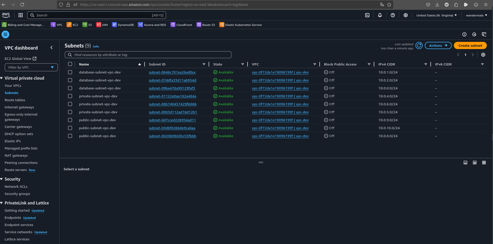


Foi habilitada o suporte a DNS, para ser utilizado com o Route53, e a utilização de single nat gateway. Este último foi habilitado para reduzir custos.


A seguir está o diagrama da estrutura da VPC:


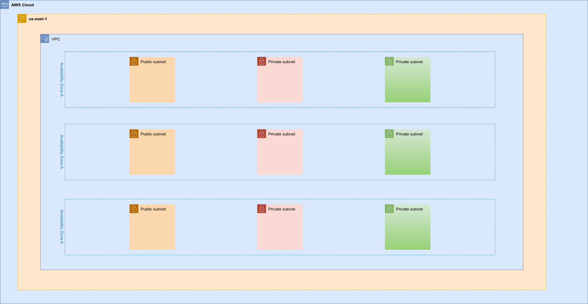


A única diferença entre a VPC de DEV e PRD é o range de IPs, que são definidos pelas variáveis do arquivo `terraform.tfvars` do respectivo workspace. Para DEV está definido o CIDR **"10.0.0.0/16"**, enquanto para produção está definido o CIDR **"192.168.0.0/16"**. 


### RDS

O RDS definido para esse projeto utiliza a engine do MySQL 8. A instância criada é do tipo **"db.t4g.micro"**. Esse modelo de instância utliza processadores AWS Graviton2 (Arquitetura ARM) e são mais baratos do que os equivalentes de arquitetura X86_64.

O subnet group criado juntamente com a VPC é utilizado para o instalação do RDS.

Foi criado também um security group que permite acessoa apenas na porta do banco (3306) e de origem das subnetes privadas. Poderia também ser utilzada uma Network ACL, mas, para este caso, o security group atende perfeitamente e é mais simples.

A seguir estão os prints do RDS criado:

Conectividade e segurança:

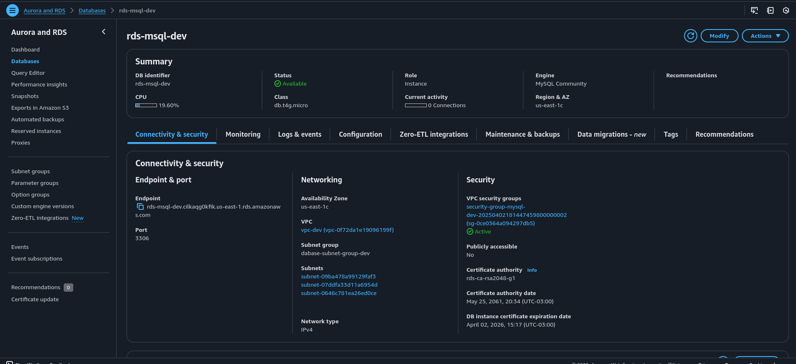

Subnet group:

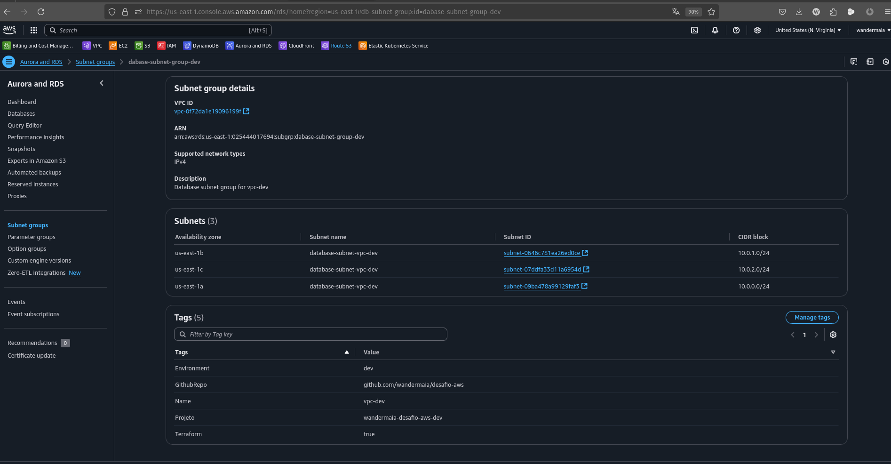


### EKS


Para a instalação do EKS foi utilizado o blue print do terraform disponibilizado pela própria AWS. 

Na criação das subnetes foi necesário adicionar as tags `"kubernetes.io/role/internal-elb"` e `"kubernetes.io/role/elb"` para que o EKS saiba quais são as redes para subir os load balancers para acesso público e privado. Essas mesmas subnets também precisaram da marcação da tag `"kubernetes.io/cluster/eks_cluster_name"` para que o EKS possa utilizar essas subnets.

Por padrão o EKS utiliza um storage class configurado para EBS do tipo **gp2 não criptografado**. Critografia, mesmo para dados em repouso, é uma boa prática da AWS. Então, criamos um novo storage class que utiliza volumes EBS **gp3 e criptografia habilitada**. Em seguida, esse novo storage class é definido com padrão do ambiente.

Para a execução dos workloads, foi criado um nodegroup com instâncias EC2 do tipo **SPOT**. Para utilização desse tipo de instâncias, acessamos o link do **[instance-advisor](https://aws.amazon.com/pt/ec2/spot/instance-advisor/)** para verificar a frequência média de interrução das instâncias. Após isso, definimos três modelos com uma boa capactidade e baixa taxa de interrupção para serem utilizadas no nodegroup. Poderiam ser vaŕios modelos e das mais diferentes capacidades, mas para o nosso contexto apenas três são suficientes.

A diferença de custos entre uma instância ON DEMAND e uma SPOT, o **desconto da SPOT passa de 60%**. A seguir está um print do instance advisor, coletado no momento da escrita deste documento, exibindo duas das instâncias que estamos utilizando no nodegroup:


Neste ponto cabe uma melhoria: verificar a frequência média de interrução das instâncias automaticamente para sempre atualizar o nodegroup com as melhores opções de instâncias SPOT, visto que o percentual de interruções pode variar de acordo com a demanda do tipo de instância e da região onde está sendo utilizada.

Verifiquei a possibilidade de utilizar o `AWS Fargate` ao invés das instâncias. Já havia avaliado ele em outras ocasiões e é mais caro do que utilizar instâncias EC2, ainda mais comparado ao contexto de SPOT. Dessa forma, optamos por utilizar nodegroup de instância EC2.

Outra vantagem de utilizar o blue print para EKS é a facilidade em configurar os Addons e algumas funcionalidades que seriam mais trabalhosas. As que foram utilizadas na instalação são:

- Load Balancer Controller

- Metric Server

- Cluster Autoscaller

- Nginx Ingress Controller

- Addons VPC CNI, CoreDNS, EBS CSI Driver, kube-proxy e EKS Pod Identity Agent.


Existem outras funcionalidades como o karpenter, velero, cert manager, ArgoCD dentre outros. Mas para este projeto, utilizamos apenas os descritos acima.


Para garantir a elasticidade do cluster, o Cluster autosaceller ajusta o nodegroup adicionando ou removendo EC2 conforme o consumo de recursos do ambiente.

No nível de kubernetes, foram criados HPAs (Horizontal Pod Autoscaling) para que as aplicações também possam escalar ou reduzir pods conforme a necessidade.


### Route53


O Route53 foi utilizado para a criação de DNS para teste interno através do resource padrão do terraform para o Route53.

Foi criada a zona interna `wandermaia.com`, na qual realizamos o apontamento do RDS, da API e front da Calculadora. As entradas criadas para este projeto estão descritas a seguir:

- RDS: CNAME apontando para o endereço do RDS. O endereço é gerado em tempo de excução com base nas variáveis de ambiente (DEV ou PRD) do workspace. Para DEV será `mysql-dev.wandermaia.com`, enquanto para produção será `mysql-prd.wandermaia.com`

- calculadora-api - CNAME apontando para o load balancer de aplicações. O endereço segue o mesmo padrão do RDS ficando da seguinte forma: `"calculadora-api-dev.wandermaia.com"` e `"calculadora-api-prd.wandermaia.com"`, para DEV e PRD respectivamente.

- magic-calculator - CNAME apontando para o load balancer de aplicações. Também segue o mesmo padrão: `"magic-calculator-dev.wandermaia.com"` e `"magic-calculator-prd.wandermaia.com"`, para DEV e PRD respectivamente.


### ALB e CloudFront


Para a publicação das aplicações foi criado uma distribuição do CloudFront e um ALB subnet pública pelo Terraform. 

A seguir está um diagrama da publicação final da estrutura do ambiente:


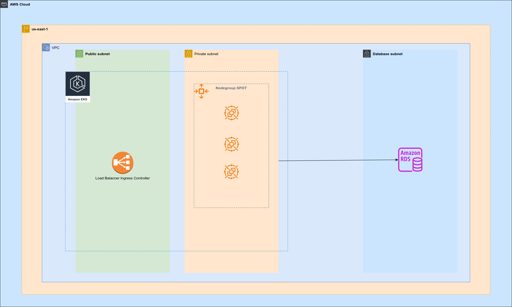


### Signoz (APM)


Para o monitoramento, inicialmente havia pensado em utilizar o Prometheus com Grafana, mas pela facilidade de instalação e funcionalidades, acabei optando pelo Signoz. A instalação do Signoz foi realizada pelo módulo `helm_release` do terraform.

O SigNoz, como descrito no próprio site: "**[SigNoz](https://signoz.io/)** é uma alternativa de código aberto ao Datadog ou New Relic. Obtenha APM, logs, traces, métricas, exceções e alertas em uma única ferramenta." Uso o SigNoz atualmente e realmente é uma ótima ferramenta. Ela vai atender muito bem este projeto.

Para acesso a interface WEB, também foi criado um ingress (ALB internet-facing) para realização dos testes. 

> **OBSERVAÇÃO:** 
>
> - Por ser uma ferramenta que tem informações de toda a infraestrutura, eu prefiro que a interface esteja disponível somente na rede interna. Mas foi disponibilizada dessa forma para facilitar os testes.
>

Além do SigNoz, propriamente dito, também foi instalada a integração do cluster EKS através do `opentelemetry`. Também foi utilizado o helm neste caso. A única atividade que ficou manual na instalação desa ferramenta é a instalação dos Dashboards. Eles estão disponíveis no GitHub em arquivos no formato json. O processo de import é igual ao do Grafana.

A seguir estão alguns prints coletados no ambiente após a instalação no cluster EKS:

Logs do pod do Magic Calculator (Frontend:)


Métricas dos worker nodes do EKS:

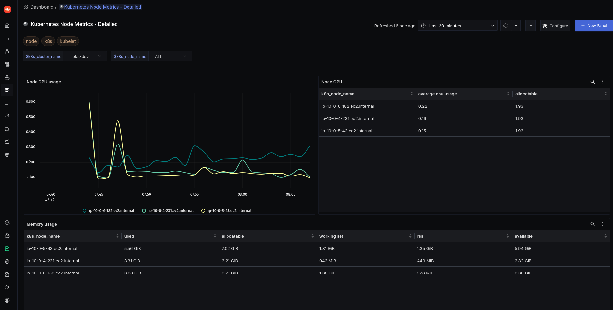

Métricas de consumo de recursos dos PODs:

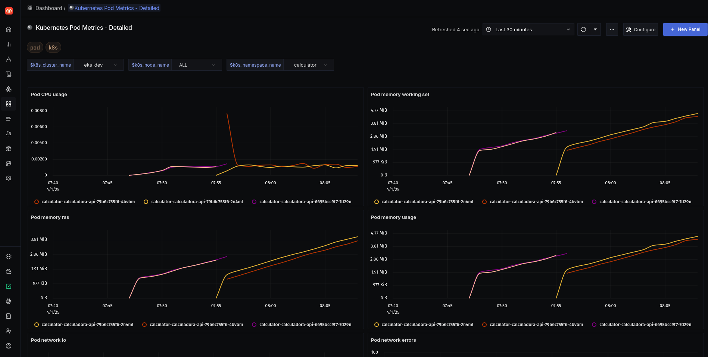

Métricas de consumo de recursos por node do EKS:

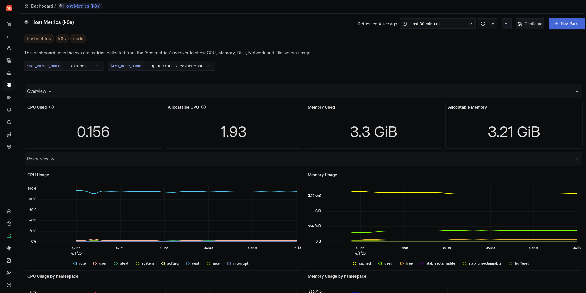


## Dificuldades na Publicação das Aplicações


Incialmente havia criado um ingress do tipo LB para cada aplicação. Esse ingress gera um ALB nas subnetes de públicas, porém ele é gerado no momento da aplicação dos manifestos do kubernetes e ainda existe a possibilidade desse load balancer ser alterado.

Diante disso, avaliei a possibilidade de utilizar o workflow da aplicação para configurar a distribuição do cloudfront no momento do deploy da aplicação. Essa abordagem é mais complexa de ser realizada, visto que a quantidade de parâmetros para alteração pelo AWS CLI é grande. 

Dessa forma, resolvi seguir uma abordagem diferente: usei o terraform para criar um ALB já com os devidos target groups na subnet pública e, em seguida, crio a distribuição do CloudFront pelo próprio terraform e já realizo a configuração para o ALB criado. Com isso passou a ser necessário que o workflow configure apenas os target groups associados com as aplicações, ou seja, o worflow da api-calculadora vai configurar o target group referente a API e o workflow do frontend-magic-calculator vai configurar o target group referente ao frontend.

Neste ponto esbarrei com mais um pequeno problema: não é possível utilizar um ALB como target Group de outro ALB. Isso só é permitido de NLB (Network Load Balancer) para ALB (Aplication Load Baalncer). Então removei o ingress e adicionei um service do tiop load balancer, gerando um NLB na subnet privada.

Apesar de não ser possível criar target groups apontando para o endereço do NLB, podemos utilizar target groups do tipo IP e adicionar todos os três IPs do NLB (IP das três subnetes privadas e cross-zone habilitado), pois os IPs do NLB não são alterados. Essa foi a abordagem utilizada no workflow para solucionar o problema.

O workflow utiliza o AWS CLI para identificar o endereço do load balancer, verifica para quais IPs o endereço está resolvendo o nome e, em seguida, adiciona eles no Target group. Toda execução do workflow este comando pode ser executado sem problemas, pois se o IP já existir no target group, ele não aparesenta erro.

Após isso, a publicação funcionou perfeitamente. 


## Evoluções Para o Projeto

A seguir estão descritas as melhorias que podem ser implementadas no projeto

### Segurança

Na implementação atual, é possível chamar o ALB a partir da internet sem passar pelo CloudFront. Existem duas maneiras de resolver este problema: via security group e via ACL de WAF. 

Para implementar a regra via security group a AWS fornece uma lista de prefixos do CloudFront, mas para utilizar ela quase extrapola o limite de prefixos do Security group. É possível solicitar a AWS para aumentar quantidade de regras suportadas pelo security group.

No caso do WAF, ele não foi habilitado no ambiente para não aumentar os custos. Em um ambiente produtivo, essa também é uma opção válida.

Ainda existe uma terceira opção, mas essa tem que estar em região compatível da AWS: habilitar a origem privada da VPC. Dessa forma o cloudfront passa a ser o único ponto de entrada a partir da interet, pois o backend da distribuição é a rede privada da VPC.


## Referências

Documentações consultadas durante o desenvolvimento do projeto:


Use IAM roles to connect GitHub Actions to actions in AWS

https://aws.amazon.com/pt/blogs/security/use-iam-roles-to-connect-github-actions-to-actions-in-aws/


Terraform Workspaces

https://developer.hashicorp.com/terraform/language/state/workspaces


AWS Provider Terraform

https://registry.terraform.io/providers/hashicorp/aws/latest/docs


kubernetes Provider  Terraform

https://registry.terraform.io/providers/hashicorp/kubernetes/latest


Helm Provider Terraform

https://registry.terraform.io/providers/hashicorp/helm/latest


Backend Block S3 - Terraform

https://developer.hashicorp.com/terraform/language/backend/s3


AWS VPC Terraform module

https://registry.terraform.io/modules/terraform-aws-modules/vpc/aws/latest


AWS EKS Terraform module

https://registry.terraform.io/modules/terraform-aws-modules/eks/aws/latest


Complete VPC Module parameters

https://github.com/terraform-aws-modules/terraform-aws-vpc/blob/master/examples/complete/main.tf


cidrsubnet Function

https://developer.hashicorp.com/terraform/language/functions/cidrsubnet


Resource: aws_cloudfront_distribution

https://registry.terraform.io/providers/hashicorp/aws/latest/docs/resources/cloudfront_distribution


Infracost

https://github.com/infracost/infracost


AWS RDS Terraform module
https://registry.terraform.io/modules/terraform-aws-modules/rds/aws/latest


Complete example

https://github.com/terraform-aws-modules/terraform-aws-rds/blob/master/examples/complete-mysql/main.tf


Controle o tráfego para seus recursos da AWS usando grupos de segurança

https://docs.aws.amazon.com/pt_br/vpc/latest/userguide/vpc-security-groups.html


Docker - Multi-stage builds

https://docs.docker.com/build/building/multi-stage/


Automate CloudFront updates when load balancer endpoints change by using Terraform

https://docs.aws.amazon.com/prescriptive-guidance/latest/patterns/automate-cloudfront-updates-when-load-balancer-endpoints-change.html


Restrict access with VPC origins

https://docs.aws.amazon.com/AmazonCloudFront/latest/DeveloperGuide/private-content-vpc-origins.html


AWS-managed prefix list weight

https://docs.aws.amazon.com/vpc/latest/userguide/working-with-aws-managed-prefix-lists.html#use-aws-managed-prefix-list


What is SigNoz?

https://signoz.io/docs/introduction/


Deploying SigNoz to AWS

https://signoz.io/docs/install/kubernetes/aws/


Kubernetes Infra Dashboard

https://github.com/SigNoz/dashboards/tree/main/k8s-infra-metrics


Amazon EKS Monitoring with OpenTelemetry

https://signoz.io/blog/eks-monitoring-with-opentelemetry/

